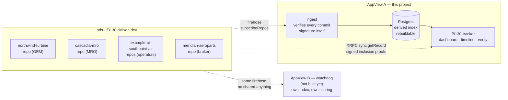
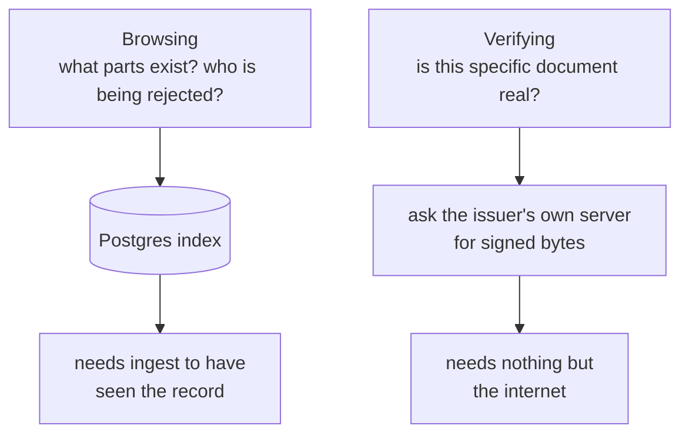
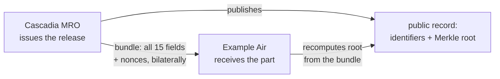

# f8130 — verifiable release certificates on AT Protocol

> ## ⚠️ ALL DATA IN THIS REPOSITORY IS SYNTHETIC
>
> Fictional organizations, fictional CAGE codes, non-existent part numbers.
> Nothing here is an airworthiness record, and nothing here is an accepted
> scheme for one. FAA AC 120-78A permits electronic records and signatures,
> but a DID-signed record is **not** an approved method. This is a protocol
> demonstration and must never be presented as an airworthiness system.

A demonstration that FAA 8130-3 Authorized Release Certificates, and the
back-to-birth traceability behind them, can be made cryptographically
verifiable using AT Protocol as the identity, storage, and distribution
layer — while disclosing none of the commercially sensitive contents.

## The idea

**Publish a commitment, deliver the document.**

The real failure mode in aviation parts fraud is not tampering with shared
records. It is forgery at the source: documents attributed to real, reputable
repair stations that never issued them. So a repair station's atproto handle
*is* its domain, DNS-verified, and its records are signed by keys in its DID
document. A release certificate is valid only if a matching commitment record
exists in the issuer's own repo. Forging one requires compromising the
station's domain *and* its signing key, not editing a PDF.

The public record carries only identifiers and a Merkle root over the form's
fields. The document itself — findings, cost, customer — travels bilaterally
as a "bundle," exactly as paperwork moves today. Anyone can verify authorship
and integrity; nobody learns the commercial content.

Completeness stays public even when contents are not. Each release links its
predecessor, so a seller can withhold a document but cannot hide that the
chain fails to reach birth.

[**docs/commitments.md**](docs/commitments.md) works the cryptography through
from first principles — a four-field toy tree with reproducible hashes, why the
nonces are not optional, how one field is opened against the published root
without the issuer's involvement, and what the scheme still cannot do.

## Architecture

The load-bearing line in this diagram is the dashed one. Everything to its
right reads the repositories **only** over XRPC and the firehose — never the
PDS's disk or database, even though they run in the same Railway project.
Break that once and the demonstration becomes a normal database with extra
steps.



Two paths run through the app, and they are genuinely independent:



Verification consults **no database**. It resolves the handle through DNS,
asks that issuer's PDS for a signed record proof, recomputes the commitment
from the document in your hand, then follows `prev` references to birth —
crossing whatever servers the chain happens to span. The index exists purely
for discovery, which is why the app still verifies documents correctly with
`DATABASE_URL` unset.

And the document itself never touches this system at all:



Findings, cost, and customer travel shop-to-customer exactly as paperwork does
today. The public record carries only what is stamped on the part plus a
commitment. Anyone can check authorship and integrity; nobody learns the
commercial content — and no AppView ever stores a bundle.

## Status

Early. Built so far:

| | |
|---|---|
| `lexicons/` | `release`, `acceptance`, `dispute` record schemas |
| `core/` | TypeScript commitment core and the seven-stage verification pipeline |
| `commitment/` | Go implementation of the same commitment scheme |
| `ingest/` | firehose consumer, signature verification, derived Postgres index |
| `cmd/ingest/` | `run` and `reindex` commands |
| `web/` | the AppView — verify page, part timeline, dashboard, JSON API |
| `seed/` | one-shot job that provisions the accounts and writes the scenarios |
| `watchdog/` | AppView B — an independent reader with its own index and its own rule |
| `testdata/vectors.json` | the cross-language contract both cores must satisfy |
| `spike/` | validation that the atproto verification primitives hold up |
| `docs/commitments.md` | the commitment scheme explained, with worked examples |

Running live on Railway with real repositories, real signing keys and real
`did:plc` identities, both AppViews reading them, issuance and verdicts
through the UI, and selective disclosure. Every milestone from the original
plan is built.

Deliberately not built, and documented as gaps rather than quietly fixed:
individual counter-signing, aircraft logbooks, revocation, and nonce
custody — see [Known gaps](#known-gaps).

Run it locally with nothing installed and nothing deployed:

```bash
npm install
npm run dev                             # http://localhost:3000
curl localhost:3000/demo/bundles.json   # genuine, tampered, forged
```

Demo mode serves an in-memory network of real repositories with real signing
keys and real inclusion proofs. Paste the `tampered` bundle into the verify
page to see the moment the design is built around: a genuine signature beside
a commitment that no longer matches.

```bash
npm install && npm test        # TypeScript: commitment core + verification pipeline
go test ./commitment/          # Go core, against the same vectors

# Database tests need a live PostgreSQL; without the variable they skip.
F8130_TEST_DSN='postgres://...' go test ./ingest/
```

## Deployment

Five services in one Railway project:

| service | role | address |
|---|---|---|
| `pds` | the stations' repositories — the data | `f8130.cldixon.dev` |
| `ingest` | firehose consumer; verifies every commit signature | private |
| `Postgres` | derived index, rebuildable from the firehose | private |
| `f8130-tracker` | AppView A — verify, browse, trace | [f8130-tracker-production.up.railway.app](https://f8130-tracker-production.up.railway.app) |
| `seed` | one-shot job; provisions accounts and scenarios | — |
| `watchdog-ingest` | AppView B's own consumer, over the **public** firehose | private |
| `Postgres-8BEk` | AppView B's own index | private |
| `watchdog` | AppView B — issuers ranked by independent rejection | [watchdog-production-7c07.up.railway.app](https://watchdog-production-7c07.up.railway.app) |

The two AppViews share the record schemas and nothing else: no database, no
code, no API, no agreement. AppView B connects to
`wss://f8130.cldixon.dev` over the public internet rather than through
Railway's private network, because a reader with privileged access would not
be demonstrating anything. It backfills from the start of the log, so it can
join late and still see everything.

Meridian Aeroparts verifies **cleanly in A** — every certificate really was
signed by the organization claiming it — while being **flagged in B**, because
three unrelated operators refused its parts. Both readings are correct. They
answer different questions, and no platform arbitrates between them.

`f8130.cldixon.dev` serves the AT Protocol PDS, not a user interface — that
separation is the point. The five handles are subdomains of it, so
`northwind-turbine.f8130.cldixon.dev/.well-known/atproto-did` returns that
organization's DID.

**A deployment with no environment variables set comes up correct.** That is a
deliberate property, not luck. Recreating a Railway service silently drops every
variable it had, and the first time that happened here the app booted green,
served every page, and failed every verification — because it was pointed at the
real network with no PDS behind it. Broken-but-healthy-looking is the worst
failure mode available, so the zero-configuration case is now the default and is
covered by tests.

| variable | default | effect |
|---|---|---|
| `F8130_MODE` | `demo`, or `live` when `DATABASE_URL` is set | which network to read |
| `DATABASE_URL` | unset | enables browsing; verification never needs it |
| `PORT` / `HOST` | `3000` / `::` | IPv6 first, falls back to IPv4 |
| `PLC_URL` | `plc.directory` | identity directory, live mode only |

A demo instance says so in the UI and on `/api/health`, so an instance serving
an in-memory network can never be mistaken for one reading the real thing.

Configuration that matters, recorded because it was not obvious:

- **`railway.json` points the build at `web/Dockerfile`.** This repository holds
  a Node workspace and a Go module side by side, and Railway's build detection
  finds `go.mod` at the root first — an early deploy attempt built the Go
  service by mistake and failed fetching a Go toolchain. Each service declares
  its own Dockerfile rather than relying on detection. (Setting
  `RAILWAY_DOCKERFILE_PATH` achieves the same thing if the config file is ever
  not picked up.)
- **`F8130_DEMO_MODE=1`.** No PDS or database is attached yet, so the service
  runs against the in-memory network and serves sample bundles at
  `/demo/bundles.json`.
- Autodeploy needs the Railway GitHub App to have access to this repository,
  granted at github.com/settings/installations. Changing any service variable
  also forces a rebuild from the branch head.

## Two implementations on purpose

The commitment scheme is meant to be implementable from its specification
alone. The only way to know whether it actually is — rather than having
quietly encoded a JavaScript quirk — is to write it twice and make both agree
byte for byte.

That has already earned its keep. JavaScript's `\s` matches non-breaking
spaces, Unicode space separators, and the BOM; Go's matches five ASCII
characters. A form pasted out of a spreadsheet would have canonicalized
differently in the two languages, and the disagreement would have surfaced
much later as an unverifiable document rather than as an error.

## Design notes

- **Field order is schema.** Changing the order, membership, or normalization
  of the committed field set changes every root ever produced. Versioned,
  never edited.
- **Nonces are non-negotiable.** 8130-3 fields are extremely low entropy — a
  status is one of five values. An unsalted commitment is brute-forced
  instantly by anyone holding the root.
- **Domain separation prefixes are mandatory.** Without them an internal node
  can be presented as a leaf.
- **Null and absent are identical; an empty string is neither.** A shop that
  wrote nothing in the remarks box committed to an empty remarks box, which is
  a different claim from having no remarks field.
- **Bundles never touch server storage.** Holding them would rebuild the
  central repository of sensitive data the design exists to avoid.

## Known gaps

Stated rather than silently fixed:

- **Nonce custody is unsolved.** Lose the bundle and the part becomes
  unverifiable even though the commitment stands. Production would need
  escrow or deterministic nonce derivation from a station-held secret.
- **Timestamps are claims.** `completedAt` is attacker-controlled; a
  self-hosted PDS can backdate. Only an independent observer's recorded time
  means anything, and one observer is a partial defense at best.
- **No revocation flow** for a release whose issuer is later decertified.
- **`signerCert` is a string**, not a DID reference. Individual
  counter-signing and aircraft logbooks are documented extensions,
  deliberately not built.

## Credits

Design and specification by [@cldixon](https://github.com/cldixon).
