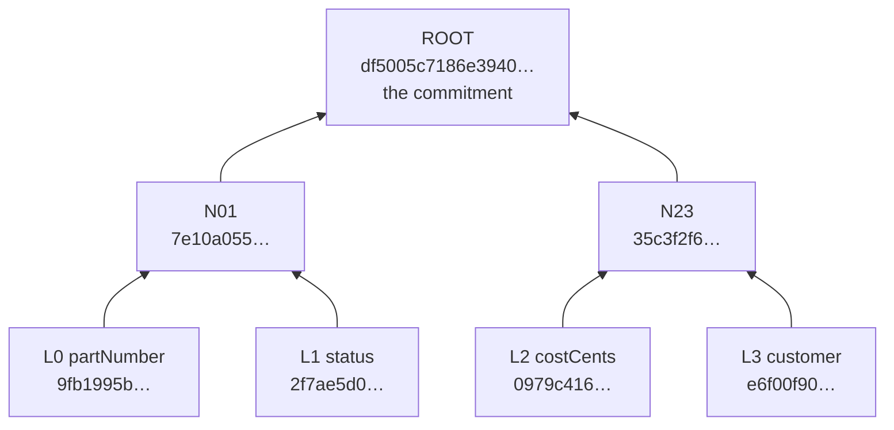
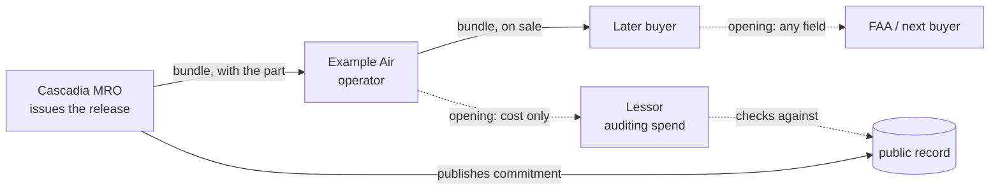

# Commitments, Merkle trees, and selective disclosure

> **SYNTHETIC DEMONSTRATION DATA.** Every value in this document is fictional.
> Nothing here is an airworthiness record or an approved method for one.

This explains the cryptography underneath f8130: what the repair station
publishes, why it takes the shape it does, and how a third party can be shown
one number from a maintenance record without being shown the rest.

Every hash in this document is real and reproducible. The recipe is at the end.

---

## The problem

An 8130-3 release certificate contains two very different kinds of information.

Some of it is public by nature — the part number, the serial, whether the unit
was overhauled or merely inspected, when the work finished. Much of it is
stamped on the metal.

The rest is commercially sensitive. What the shop found wrong. What the repair
cost. Which airline owned it. A repair station that publishes its cost
structure to a searchable public record is a repair station whose competitors
price against it by Friday.

Today the industry resolves this by publishing nothing and passing PDFs
around, which is why forgery works.

The goal is a public record that lets **anyone** confirm a document is
authentic and unaltered, while learning **nothing** about its commercial
contents — and that later lets a specific counterparty be shown one specific
field, without the issuer's involvement.

---

## The one-paragraph version

The station computes a single 32-byte fingerprint over all fifteen fields of
the form and publishes only that. The document itself travels privately, hand
to hand, as it does today. Anyone holding the document can recompute the
fingerprint and check it against the published one: match means the document
is exactly what the station committed to, down to the byte. The fingerprint is
built as a tree rather than a single hash, which additionally lets the holder
prove any one field against the same published fingerprint without revealing
the other fourteen.

---

## Part 1 — A toy example

The real scheme uses fifteen fields. Four is enough to see the whole shape, so
this section uses four. Everything else is identical.

### Step 1: canonicalize

Before anything is hashed, values are put into one canonical form, so that two
people typing the same thing produce the same bytes. `nt-8821/04`,
`NT 8821 04`, and `NT882104` are the same part number written three ways, and
they must not produce three different fingerprints.

| rule | applies to | effect |
|---|---|---|
| strip separators, uppercase | identifiers | `nt-8821/04` → `NT882104` |
| NFC, collapse whitespace, trim | prose | `" wear   beyond limits "` → `"wear beyond limits"` |
| RFC 3339, forced UTC, seconds | timestamps | `2026-01-22T04:30:00-05:00` → `2026-01-22T09:30:00Z` |
| integers only, never floats | money, counts | money is cents; `1284.5` is rejected |

Two rules carry more weight than they look:

**`null` and absent are the same thing; an empty string is neither.** A shop
that wrote nothing in the remarks box committed to an empty remarks box. That
is a different claim from having no remarks field at all, and the fingerprint
distinguishes them.

**Field order is schema.** Changing the order, the membership, or any field's
normalization changes every fingerprint ever produced. It is versioned, never
edited in place.

### Step 2: hash each field on its own, with a random nonce

Each field becomes a *leaf*:

```
leaf = SHA256( 0x00 ‖ cbor(fieldName) ‖ cbor(value) ‖ nonce )
```

The nonce is 32 bytes from a cryptographic random source, fresh per field, per
document. Part 2 explains why it is not optional.

Toy values, using deliberately fake nonces (`01` repeated 32 times, `02`
repeated 32 times, and so on) so you can reproduce them:

| | field | value | leaf |
|---|---|---|---|
| `L0` | partNumber | `"NT882104"` | `9fb1995ba3048963…` |
| `L1` | status | `"OVERHAULED"` | `2f7ae5d0506b4d6f…` |
| `L2` | costCents | `1284500` | `0979c41638f499b9…` |
| `L3` | customer | `"Example Air"` | `e6f00f90b5fd4ebf…` |

### Step 3: pair them up until one value remains

```
node = SHA256( 0x01 ‖ left ‖ right )
```



The full values:

```
N01  = node(L0, L1)   7e10a055f05c937b92d4b8494ec2c34bdc8272fd0c32baa4b776c14574e284ae
N23  = node(L2, L3)   35c3f2f6ee98e438e7458dc18bb31dab612189d2b40c745e59166751a411b84b
ROOT = node(N01, N23) df5005c7186e3940ef151b58063ee4cbc738a9c52febfbbc587b1f8e75948f75
```

### Step 4: publish the root, and only the root

**The root is the commitment.** The tree is the construction; its topmost node
is the published output. The leaves and intermediate nodes are computed and
thrown away — anyone holding the values and nonces can rebuild them, and
nobody else can rebuild any of them.

Change one field and the root is unrecognisable. Same tree, cost changed from
`1284500` to `100000`:

```
ROOT  = df5005c7186e3940ef151b58063ee4cbc738a9c52febfbbc587b1f8e75948f75
ROOT' = a32fb12d9096b2f86c633f856cb1e2fec4245e61acdd120bde7ac88c55517f48
```

There is no partial similarity to detect and no threshold to tune. It matches
or it does not.

---

## Part 2 — Why the nonces are not optional

8130-3 fields have almost no entropy. A status is one of five values. A cost
is a number of dollars. If a leaf were just `hash(fieldName, value)`, the hash
*is* the value, because the search space is tiny.

Measured against the real implementation with the nonces removed:

| field | search space | guesses to crack |
|---|---|---|
| `status` | 5 enum values | **2** |
| `costCents` | round dollars to $50,000 | **12,846** — well under a second |

With a 32-byte nonce, the same attack tried **1,000,020 (value, nonce) pairs
and found nothing**, because the attacker must now guess the value *and* the
nonce — a 2^256 space, around 10^77. The low entropy of the value buys the
attacker nothing at all.

Note the causal chain, because it is easy to get backwards. A single hash over
the *whole form* would not have this weakness — you would have to guess all
fifteen fields at once, which is genuinely hard. **The exposure is created by
splitting into per-field leaves**, and we split into per-field leaves
specifically to enable Part 4. The nonces are the cost of that feature, not
optional hardening.

---

## Part 3 — Why a tree instead of one hash

A single `hash(entire form)` would support everything in Part 1: publish it,
recompute it, detect any change.

What it cannot do is open a part of itself. The only way to let someone check
one field is to hand them the entire form so they can recompute the whole
hash. There is no structure to work with.

A tree makes the root a **summary of independently openable pieces**. Each leaf
can be revealed on its own, with a short receipt, and the same published root
validates every one of them.

---

## Part 4 — Opening a single leaf

First, the thing that surprises everyone:

> **You cannot open a leaf *from* the commitment.** The commitment is one-way
> and inert. It is not a container, an index, or something you can expand or
> query. There is nothing inside it to get out.

Its only ability is to answer **yes or no to a claim someone else brings you.**

So the direction is inverted from what "opening" suggests. Nobody opens the
commitment. Somebody hands you an *opening*, and the commitment is what you
check it against.

An opening for one field is three things:

1. the **value** — `costCents = 1284500`
2. its **nonce** — the 32 bytes hashed with it
3. the **sibling path** — the hashes needed to climb to the root

For `L2` in the toy tree, the path is two hashes:

| level | sibling | side |
|---|---|---|
| 0 | `L3` = `e6f00f90b5fd4ebf…` | right |
| 1 | `N01` = `7e10a055f05c937b…` | left |

The verifier folds them:

```
leaf(costCents, 1284500, nonce)   0979c41638f499b94e0407dae2d8bfa5157ff6534d56567ea1c02ab614a1adb3
+ L3   (right)                    35c3f2f6ee98e438e7458dc18bb31dab612189d2b40c745e59166751a411b84b
+ N01  (left)                     df5005c7186e3940ef151b58063ee4cbc738a9c52febfbbc587b1f8e75948f75
                                  ← identical to the published ROOT
```

**What the verifier learned:** the cost was $12,845.00, and the station
committed to that figure.

**What the verifier did not learn:** anything about `partNumber`, `status`, or
`customer`. `N01` is a single hash covering two salted leaves. `L3` is the
`customer` leaf itself, and it is useless for exactly the reason Part 2
demonstrated — without the nonce it cannot be brute-forced.

Sibling hashes are unavoidable; they are how the root is recomputed. They are
also inert. In the real fifteen-field tree a single-field proof carries four of
them.

### The verifier fetches the root itself

An opening deliberately does **not** include the root. The verifier retrieves
that independently, from the issuer's own repository.

This matters. If the discloser supplied the root as well, they could supply a
matching fake and the check would be circular. **The claim comes from one
party; the thing it is checked against comes from another.**

---

## Part 5 — The real scheme

Same shape, three additions.

**Fifteen fields, padded to sixteen.** The committed set is fixed and ordered:
`formNumber, partNumber, serialNumber, description, status, quantity,
workOrder, findings, workscope, costCents, customer, signerCert, signerName,
remarks, completedAt`. Every form commits to every field, with explicit `null`
for absent ones, so the tree shape is identical for every document ever
issued — a sparse form is not distinguishable from a full one by its structure.
One constant pad leaf brings sixteen to a power of two:

```
pad = SHA256( 0x02 )
```

**Domain separation.** The `0x00`, `0x01`, `0x02` prefixes are mandatory.
Without them, leaves and internal nodes are drawn from the same space, and an
attacker can present an internal node as a leaf — the classic second-preimage
attack on Merkle trees.

**Deterministic encoding.** `cbor()` is DAG-CBOR under AT Protocol's
constraints: definite lengths, shortest-form integers, map keys sorted
length-first, UTF-8 NFC, floats forbidden. Two implementations that disagree
about encoding disagree about every fingerprint.

That last point is why this repository contains **two independent
implementations** — TypeScript in `core/` and Go in `commitment/` — pinned
against shared fixtures in `testdata/vectors.json`. It has already earned its
keep: JavaScript's `\s` matches non-breaking spaces and the BOM, Go's matches
five ASCII characters, so a form pasted out of a spreadsheet canonicalized
differently in the two languages. That would have surfaced much later as an
unverifiable document rather than as a test failure.

A single-field proof in the real tree is 4 sibling hashes, and the whole
disclosure document is about 750 bytes of JSON.

---

## Part 6 — Verifying a certificate

Two independent checks, and both are needed.

**Check one — does this document produce that fingerprint?** The holder
recomputes the tree from the fifteen values and fifteen nonces and compares to
the published commitment. A match means the document is byte-for-byte what the
issuer committed to.

**Check two — is that fingerprint really the issuer's?** The commitment sits
in a record inside the issuer's own AT Protocol repository, covered by a commit
signed with their signing key. The verifier resolves the issuer's handle
through DNS to a DID, fetches the DID document, and checks the signature.

```
check one  →  document ↔ commitment
check two  →  commitment ↔ issuer
together   →  document ↔ issuer
```

Two different cryptographic objects are in play here and they are easy to
conflate:

| | what it is | where it lives |
|---|---|---|
| **signing key** | the issuer's private key | in their PDS; public half in their DID document |
| **commitment** | a 32-byte hash — a fingerprint, not a key | in the record, in their repository |

The commitment cannot encrypt, decrypt, or sign anything.

### What each check alone would miss

**Skip check one** and you accept a genuine signature over an altered document.
The station really did sign a release for this part; this just is not it. The
verify page shows this as **signature PASS, commitment FAIL**, and it is the
single most instructive result in the system.

**Skip check two** and you accept a self-consistent forgery: a fabricated form
whose fingerprint matches it perfectly, attributed to a station that issued
nothing. This is the failure mode that actually occurs in the industry —
paperwork attributed to real, reputable repair stations that never wrote it —
and it dies because there is no record in that station's repository at all.

---

## Part 7 — Who can open a field, and who gives it to you

Whoever holds the document. That is the whole answer, and the consequences are
where the design earns its keep.

The bundle — all fifteen values and all fifteen nonces — is what travels with
the part. Its holder can mint an opening for any subset of fields, for anyone,
at any time.

Follow a part through its life:



The lessor asks **Example Air**, not Cascadia. Example Air generates the
disclosure from the bundle it already holds and sends it over. Cascadia is
never contacted, does not know it happened, and could not have prevented it.

Two consequences, and they cut both ways.

**The issuer is not a gatekeeper.** They cannot be unavailable, cannot refuse,
cannot charge for access, cannot go out of business and strand a part's
paperwork. Verification and disclosure both keep working without them,
indefinitely.

**The issuer also cannot help you.** Lose the bundle and nobody can reopen that
commitment — not the station, not the FAA, not anyone. The part remains
provably authentic and becomes permanently unopenable. You could still prove
Cascadia issued *a* certificate for that serial, and never prove what it said.

That asymmetry is a real gap, not a rough edge, and it is why the next section
exists.

---

## Part 8 — Known limits

Stated rather than quietly fixed.

**Nonce custody is unsolved.** As above. A production system would need either
escrow or deterministic derivation — nonces computed as
`HKDF(station master secret, recordKey ‖ fieldName)` rather than drawn at
random, so a station can always regenerate its own without storing anything per
document. That changes the threat model (compromise of the master secret opens
every document the station ever issued) and is deliberately out of scope here.

**Disclosure cannot be revoked.** An opening, once handed over, is valid
forever and can be forwarded. There is no mechanism to un-share and no
expiry — the recipient holds a permanently checkable proof.

**Withholding is visible, which is the point.** A disclosure names the fields
it did not reveal. A verifier who could not tell which fields were withheld
could be handed a flattering subset and told it was the whole form.

**Timestamps in the record are claims.** `completedAt` is written by whoever
made the record, and a self-hosted server can backdate it. Only an independent
observer's own recorded time means anything, which is why the AppViews record
their own `observed_at` and show both.

**The commitment says nothing about correctness.** It proves a document is
what the station wrote. Whether the station did the work properly, or should
be trusted at all, is a different question — and the one the second AppView
exists to ask.

---

## Reproducing every number here

The primitives, in full:

```
leaf = SHA256( 0x00 ‖ cbor(fieldName) ‖ cbor(value) ‖ nonce )
node = SHA256( 0x01 ‖ left ‖ right )
pad  = SHA256( 0x02 )
```

where `cbor()` is DAG-CBOR, `nonce` is 32 bytes, leaves are in the fixed field
order, and the leaf count is padded to the next power of two.

The toy example uses four fields with nonces of `0x01` × 32, `0x02` × 32,
`0x03` × 32, `0x04` × 32 in that order.

The authoritative fixtures for the real fifteen-field scheme are in
[`testdata/vectors.json`](../testdata/vectors.json) — input forms, nonces,
every leaf hash, roots, record CIDs, and worked disclosure proofs. Both
implementations are tested against them, and CI fails if regenerating them
produces any diff.

```bash
npm test                       # TypeScript core, including the vectors
go test ./commitment/          # Go core, against the same vectors
```

To see it end to end, the `/disclose` page of the running app builds a
disclosure from a bundle and checks it against the live published record.
